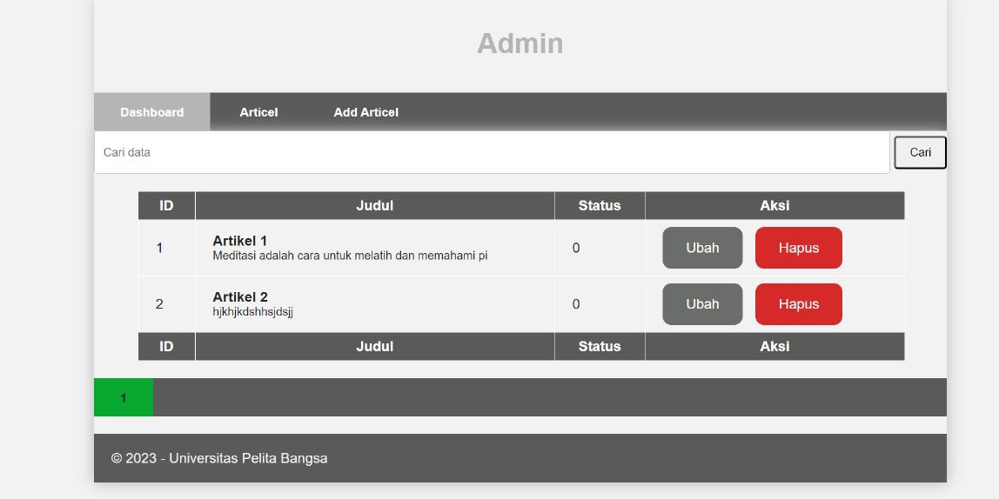

# Lab10Web

## Profil
| #               | Biodata              |
| --------------- | -----------------    |
| **Nama**        | Anindia Sasikirana   |
| **NIM**         | 312110268            |
| **Kelas**       | TI.21.A.2            |
| **Mata Kuliah** | Pemrograman Web 2    |

# 1. Membuat Pencarian

```
public function admin_index()
{
$title = 'Daftar Artikel';
$q = $this->request->getVar('q') ?? '';
$model = new ArtikelModel();
$data = [
'title' => $title,
'q' => $q,
'artikel' => $model->like('judul', $q)->paginate(10), # data
dibatasi 10 record per halaman
'pager' => $model->pager,
];
return view('artikel/admin_index', $data);
}
```

## Penjelasan

- Pertama, buatlah fungsi admin_index() di dalam controller yang sesuai dengan framework atau bahasa pemrograman

- Pada baris pertama, kita mendefinisikan judul halaman sebagai 'Daftar Artikel'.

- Pada baris kedua, kita mendapatkan nilai parameter pencarian (q) dari permintaan (request) pengguna. Jika nilai tersebut tidak ada, kita setel menjadi string kosong ('').

- Selanjutnya, kita membuat sebuah objek model untuk entitas Artikel. Pastikan Anda sudah memiliki model tersebut atau sesuaikan dengan model yang Anda gunakan.

- Kemudian, kita menginisialisasi variabel $data yang akan digunakan untuk mengirimkan data ke tampilan (view).

- Di dalam variabel $data, kita menetapkan nilai untuk 'title' dan 'q' sesuai dengan judul halaman dan nilai parameter pencarian yang diterima.

- Baris berikutnya adalah kode yang melakukan pencarian berdasarkan judul artikel menggunakan metode like() pada objek model Artikel. Kita menyertakan parameter 'judul' (nama kolom) dan nilai pencarian ($q) yang telah diterima sebelumnya. Kemudian, kita menggunakan metode paginate(10) untuk membatasi jumlah hasil pencarian menjadi 10 record per halaman.

- Setelah itu, kita menambahkan hasil pencarian 'artikel' ke dalam variabel $data.

- Terakhir, kita juga menyertakan objek pager yang diperoleh dari model untuk memungkinkan navigasi halaman pada tampilan.

- Setelah semua data ditetapkan di dalam variabel $data, kita mengembalikan tampilan 'artikel/admin_index' dengan menggunakan data tersebut.


  # 2. Ubah link pager, ubah seperti berikut pada admin_index.php

```
   <?= $pager->only(['q'])->links(); ?>
```

## Penjelasan 

- $pager merujuk pada objek pager yang telah Anda lewatkan ke tampilan dari controller sebelumnya. Objek pager ini biasanya diperoleh dari model dan digunakan untuk mengatur dan menghasilkan navigasi halaman.

- only(['q']) adalah metode pada objek pager yang digunakan untuk mempertahankan parameter pencarian 'q' dalam URL ketika pengguna berpindah halaman. Dengan menggunakan metode only(), kita hanya mempertahankan parameter 'q' dan menghapus parameter lain yang mungkin ada pada URL.

- Selanjutnya, links() adalah metode pada objek pager yang digunakan untuk menghasilkan tautan navigasi halaman. Metode ini akan menghasilkan HTML yang berisi tautan ke halaman-halaman lain dalam rangkaian halaman yang dihasilkan oleh metode paginate() pada controller.

- Jadi, dengan menggunakan <?= $pager->only(['q'])->links(); ?>, kita menghasilkan tautan navigasi halaman yang berfungsi untuk berpindah antara halaman-halaman hasil pencarian dengan mempertahankan parameter pencarian 'q' dalam URL.


# OUTPUT 


